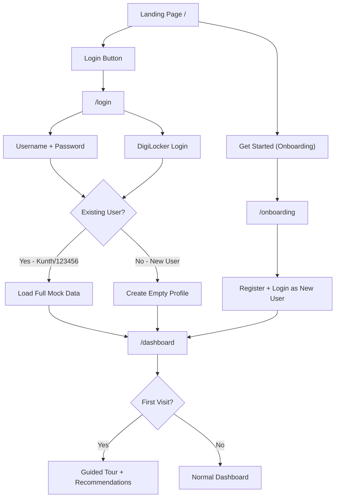

# Authentication, Login, and New User Onboarding System

## Current State

The app is a **Vite + React 19 SPA** with no authentication. Anyone can access `/dashboard` directly. The existing user "Kunth" is hardcoded in [`src/data/mockData.js`](src/data/mockData.js) with a rich portfolio (875K invested, 5 active investments, 45K wallet). State is managed via React Context + localStorage in [`src/context/AppContext.jsx`](src/context/AppContext.jsx). An onboarding questionnaire exists at `/onboarding` but its answers are stored separately and never fed into the app context.

## Architecture



## 1. Login Page (`src/pages/Login.jsx`)

Create a new page at `/login` with two login methods:

- **Credentials login**: Form with `id-name` and `password` fields. Hardcoded credentials: `Kunth` / `123456` logs in as the existing user with full mock data. Any other credentials are treated as "new user" (show error or offer registration).
- **DigiLocker login**: A simulated button (similar to the existing DigiLocker simulation in [`src/pages/KYC.jsx`](src/pages/KYC.jsx) lines 140-148). When clicked, shows a loading spinner for 2s, then creates/logs in as a new user. DigiLocker populates the user's name from a simulated API response.
- A "Don't have an account? Get Started" link to `/onboarding`.
- Style consistent with the existing onboarding page aesthetic (centered card, YieldVest branding, Framer Motion animations).

## 2. Auth State in Context (`src/context/AppContext.jsx`)

Extend the existing `AppProvider` with authentication state:

- **New state**: `isAuthenticated` (boolean), `isNewUser` (boolean), `hasSeenTour` (boolean)
- **New functions**:
  - `login(username, password)` -- validates against hardcoded credentials. For "Kunth"/"123456", loads full mock data. Returns success/failure.
  - `loginWithDigiLocker()` -- simulates DigiLocker auth, creates a new user profile with name from "DigiLocker response".
  - `logout()` -- clears auth state, resets to defaults, navigates to `/`.
  - `registerNewUser(name, onboardingAnswers)` -- creates a new user with empty portfolio.
  - `completeTour()` -- sets `hasSeenTour = true`.
- **Persist** auth state in localStorage alongside existing data under `yieldvest_app_state`.

### Credentials Store (mock)

Add to [`src/data/mockData.js`](src/data/mockData.js):

```javascript
export const registeredUsers = {
  'kunth': {
    password: '123456',
    user: defaultUser,
    portfolio: userPortfolio,
    // references existing mock data
  },
};

export const emptyPortfolio = {
  totalInvested: 0,
  currentValue: 0,
  totalReturns: 0,
  returnPercent: 0,
  activeInvestments: 0,
  xirr: 0,
  walletBalance: 0,
};
```

## 3. Route Protection (`src/App.jsx`)

- Add `/login` route pointing to the new `Login` page.
- Create a `ProtectedRoute` wrapper component that checks `isAuthenticated` and redirects to `/login` if not.
- Wrap all `/dashboard/*` routes with `ProtectedRoute`.
- Wire the onboarding completion to auto-register and log in the new user before navigating to `/dashboard`.

## 4. Navbar Login Button (`src/components/Navbar.jsx`)

Add a **"Login"** button next to the existing "Get Started" button:

- Desktop: Show "Login" as an outlined/secondary button, "Get Started" stays as primary.
- Mobile: Add "Login" to the mobile menu as well.
- "Login" navigates to `/login`.

## 5. Sidebar Logout (`src/components/dashboard/Sidebar.jsx`)

Wire the existing "Logout" button to call the `logout()` function from context instead of just `navigate('/')`.

## 6. New User Data Handling

When a **new user** logs in or registers:

- **Portfolio**: All zeros (emptyPortfolio defined above)
- **Wallet balance**: 0
- **Transactions**: Empty array
- **Active/completed investments**: Empty arrays
- **Notifications**: Welcome notification only
- **KYC status**: `not_started` (existing default)
- **Onboarding answers**: Stored in context (merged from `yieldvest_onboarding` localStorage)

When **Kunth** logs in:

- Load all existing mock data as-is (current behavior).

## 7. Onboarding-to-Auth Flow (`src/pages/Onboarding.jsx`)

When onboarding completes ("Go to Dashboard" clicked):

- Call `registerNewUser(name, answers)` from context to create the user account.
- Auto-login the user.
- Navigate to `/dashboard` where the welcome tour will trigger.
- Currently onboarding does not ask for a name -- add a **name input step** at the beginning (or as a simple field on the final "profile ready" screen) so we know what to call the new user.

## 8. Welcome Tour (`src/components/dashboard/WelcomeTour.jsx`)

Build a lightweight guided-tour overlay (no external library needed) that:

- Shows on first login for new users (`isNewUser && !hasSeenTour`).
- Steps through each major section:
  1. **Welcome greeting** -- "Welcome to YieldVest, [Name]!" with a personalized recommendation based on their risk appetite (from onboarding).
  2. **Dashboard overview** -- Explains the chat vs. dashboard view toggle.
  3. **Marketplace** -- Where to find investment opportunities.
  4. **Portfolio** -- Track your investments (currently empty, will fill up as you invest).
  5. **KYC** -- Complete this before you can invest.
  6. **AI Assistant** -- Ask questions about your finances.
- Each step: a modal/tooltip card with title, description, and "Next" / "Skip" buttons.
- On completion or skip, calls `completeTour()`.

### Personalized Recommendation Logic

Based on onboarding answers (risk appetite + investment goal + horizon), select the best-matching opportunities from the marketplace:

- **Conservative risk** -> prioritize Low-risk opportunities (Invoice Discounting, Structured Debt)
- **Moderate risk** -> balanced mix (Private Credit, P2P Lending)
- **Aggressive risk** -> higher-return opportunities (Revenue-Based Financing, P2P Lending)

Display this as a "Recommended for you" section on the welcome screen and dashboard.

## 9. Dashboard Adaptations for New Users

### [`src/pages/DashboardHome.jsx`](src/pages/DashboardHome.jsx)
- If `isNewUser && !hasSeenTour`, show the welcome tour overlay.
- "Recommended for you" section: use personalized recommendations instead of `opportunities.slice(0, 3)`.
- Stat cards show zeros gracefully (0 invested, 0 returns, etc.).

### [`src/pages/Portfolio.jsx`](src/pages/Portfolio.jsx)
- Show an **empty state** illustration/message: "You haven't made any investments yet. Explore the marketplace to get started."

### [`src/pages/Transactions.jsx`](src/pages/Transactions.jsx)
- Show an **empty state**: "No transactions yet. Your investment activity will appear here."

### [`src/components/dashboard/DashboardHeader.jsx`](src/components/dashboard/DashboardHeader.jsx)
- Greeting works as-is (uses `user.name` from context).

### [`src/components/dashboard/PortfolioChart.jsx`](src/components/dashboard/PortfolioChart.jsx), [`AllocationDonut.jsx`](src/components/dashboard/AllocationDonut.jsx), [`RepaymentWidget.jsx`](src/components/dashboard/RepaymentWidget.jsx)
- Handle empty data gracefully (show "No data yet" states).

## 10. Files Changed Summary

| File | Action |
|------|--------|
| `src/pages/Login.jsx` | **Create** -- Login page |
| `src/components/dashboard/WelcomeTour.jsx` | **Create** -- Guided tour |
| `src/context/AppContext.jsx` | **Modify** -- Add auth, new user, tour state |
| `src/data/mockData.js` | **Modify** -- Add credentials, empty portfolio |
| `src/App.jsx` | **Modify** -- Add login route, protected routes |
| `src/components/Navbar.jsx` | **Modify** -- Add login button |
| `src/components/dashboard/Sidebar.jsx` | **Modify** -- Wire logout |
| `src/pages/Onboarding.jsx` | **Modify** -- Wire to auth, add name input |
| `src/pages/DashboardHome.jsx` | **Modify** -- Tour trigger, personalized recs |
| `src/pages/Portfolio.jsx` | **Modify** -- Empty state |
| `src/pages/Transactions.jsx` | **Modify** -- Empty state |
| `src/components/dashboard/PortfolioChart.jsx` | **Modify** -- Empty state |
| `src/components/dashboard/AllocationDonut.jsx` | **Modify** -- Empty state |
| `src/components/dashboard/RepaymentWidget.jsx` | **Modify** -- Empty state |
| `src/layouts/DashboardLayout.jsx` | **Modify** -- Mount tour component |
