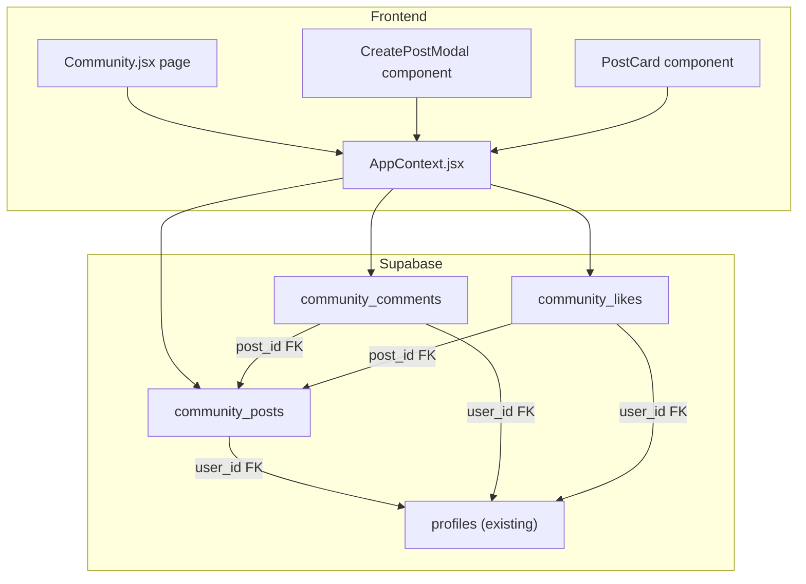

# Community Feature for YieldVest

## Architecture Overview



## 1. Database Schema (SQL)

Add three new tables to [`supabase/schema.sql`](supabase/schema.sql):

**`community_posts`** -- Main feed posts. Each post has free-form text and an optional `shared_data` JSONB column that stores a snapshot of whatever the user chose to share (portfolio summary, a specific investment, earnings milestone, etc.).

```sql
CREATE TABLE IF NOT EXISTS community_posts (
  id UUID PRIMARY KEY DEFAULT gen_random_uuid(),
  user_id UUID NOT NULL REFERENCES profiles(id) ON DELETE CASCADE,
  content TEXT NOT NULL,
  post_type TEXT DEFAULT 'text' CHECK (post_type IN ('text','portfolio','investment','milestone')),
  shared_data JSONB,
  likes_count INTEGER DEFAULT 0,
  comments_count INTEGER DEFAULT 0,
  created_at TIMESTAMPTZ DEFAULT NOW(),
  updated_at TIMESTAMPTZ DEFAULT NOW()
);
```

**`community_comments`** -- Comments on posts, enabling multi-user conversation.

```sql
CREATE TABLE IF NOT EXISTS community_comments (
  id UUID PRIMARY KEY DEFAULT gen_random_uuid(),
  post_id UUID NOT NULL REFERENCES community_posts(id) ON DELETE CASCADE,
  user_id UUID NOT NULL REFERENCES profiles(id) ON DELETE CASCADE,
  content TEXT NOT NULL,
  created_at TIMESTAMPTZ DEFAULT NOW()
);
```

**`community_likes`** -- One like per user per post.

```sql
CREATE TABLE IF NOT EXISTS community_likes (
  id UUID PRIMARY KEY DEFAULT gen_random_uuid(),
  post_id UUID NOT NULL REFERENCES community_posts(id) ON DELETE CASCADE,
  user_id UUID NOT NULL REFERENCES profiles(id) ON DELETE CASCADE,
  created_at TIMESTAMPTZ DEFAULT NOW(),
  UNIQUE(post_id, user_id)
);
```

Plus indexes, triggers for `updated_at`, and a trigger to keep `likes_count`/`comments_count` in sync on `community_posts`. A separate migration SQL file will also be created at `supabase/community.sql` so you can push it independently.

## 2. New Page: `Community.jsx`

Create [`src/pages/Community.jsx`](src/pages/Community.jsx) with these sections:

- **Header** -- "Community" title
- **Create Post area** -- A text input at the top with quick-share buttons:
  - "Share Portfolio" -- attaches a snapshot of `portfolio` (totalInvested, currentValue, totalReturns, returnPercent, xirr) from context
  - "Share Investment" -- opens a picker to select one of `userInvestments` and attaches its summary
  - "Share Milestone" -- e.g. "I just crossed X% returns!" with auto-generated text from portfolio data
  - Free-form text always available alongside any attachment
- **Feed** -- Scrollable list of `PostCard` items showing all users' posts ordered by `created_at DESC`
  - Each card shows: author name, time ago, post text, optional shared-data card (styled portfolio/investment snapshot), like button + count, comment toggle
  - Inline comment section expandable per post

### UI Patterns

Following existing conventions:
- Tailwind v4 utility classes with the project's design tokens (`bg-white`, `border-border`, `text-text-primary`, `rounded-xl`, etc.)
- `lucide-react` icons (`Users`, `Heart`, `MessageCircle`, `Share2`, `Briefcase`, `TrendingUp`, `Send`)
- No external UI library; plain JSX + Tailwind like all other pages

## 3. Routing

In [`src/App.jsx`](src/App.jsx), add a nested route under the dashboard:

```jsx
<Route path="community" element={<Community />} />
```

## 4. Navigation

- **[`src/components/dashboard/Sidebar.jsx`](src/components/dashboard/Sidebar.jsx)** -- Add `{ to: '/dashboard/community', icon: Users, label: 'Community' }` to `navItems`, placed after Portfolio
- **[`src/components/dashboard/MobileTabBar.jsx`](src/components/dashboard/MobileTabBar.jsx)** -- Add `{ to: '/dashboard/community', icon: Users, label: 'Community' }` to `BASE_TABS`

## 5. Context Layer

Add these functions to [`src/context/AppContext.jsx`](src/context/AppContext.jsx):

- **`fetchCommunityPosts()`** -- Loads posts with author name joined from `profiles`, plus whether current user has liked each post. Uses Supabase `select` with a join pattern.
- **`createCommunityPost({ content, postType, sharedData })`** -- Inserts a new post for the current user.
- **`togglePostLike(postId)`** -- Inserts or deletes a like row, updates `likes_count` on the post.
- **`fetchPostComments(postId)`** -- Loads comments for a given post with author names.
- **`createPostComment(postId, content)`** -- Inserts a comment and increments `comments_count`.
- **`deleteCommunityPost(postId)`** -- Allows deletion of own posts.

All functions follow the same pattern as existing `createTicket`/`fetchTickets` (use `session?.user?.id`, call `supabase.from(...)`, return data).

## 6. Files Changed / Created

| File | Action |
|------|--------|
| `supabase/schema.sql` | Append community tables |
| `supabase/community.sql` | New standalone migration file |
| `src/pages/Community.jsx` | New page |
| `src/App.jsx` | Add route + import |
| `src/components/dashboard/Sidebar.jsx` | Add nav item |
| `src/components/dashboard/MobileTabBar.jsx` | Add nav item |
| `src/context/AppContext.jsx` | Add community CRUD functions + expose in value |
