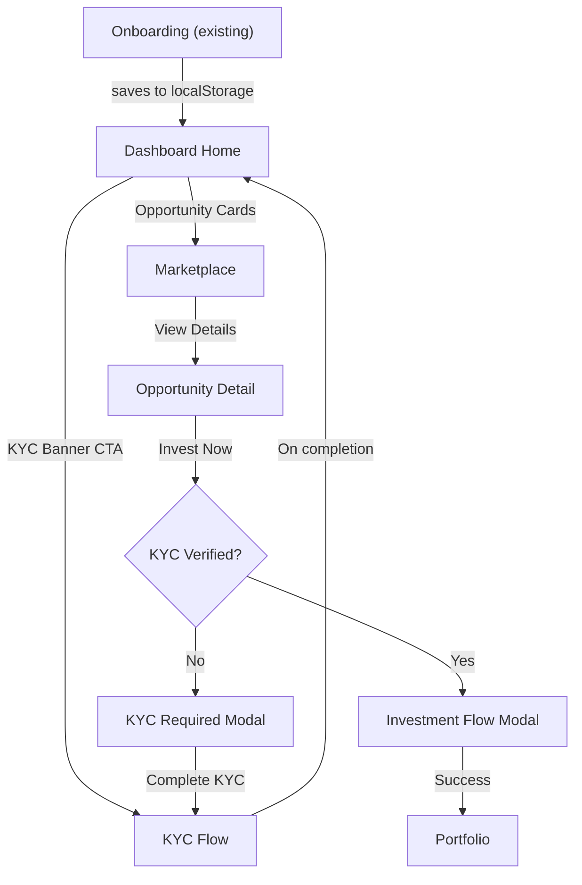

# YieldVest Dashboard & Investment Platform

## Current State

- Vite + React 19 + Tailwind CSS v4 + React Router v7 + Framer Motion + Lucide React
- Three routes exist: `/` (landing), `/onboarding` (8-step wizard), `/dashboard` (placeholder)
- No auth, no backend, no state management beyond `useState` and `localStorage`
- Design system defined in [`design guidelines.md`](design guidelines.md) and [`src/index.css`](src/index.css)
- Onboarding saves answers to `localStorage` key `yieldvest_onboarding`

## Architecture Decisions

### State Management
Add a React Context (`AppContext`) to manage:
- User profile (name from onboarding, mock data)
- KYC status (`not_started | in_progress | pending_verification | verified`)
- KYC step progress (which step was last completed)
- Portfolio/investment data
- Wallet balance
- Notification state

All persisted to `localStorage` so state survives page refreshes.

### Routing
Convert flat routes to nested layout routes. The dashboard gets its own layout with sidebar/header, and all dashboard sub-pages render inside it via `<Outlet />`.

```
/                       -> Landing
/onboarding             -> Onboarding
/dashboard              -> DashboardLayout wrapper
  /dashboard            -> DashboardHome (index route)
  /dashboard/marketplace -> Marketplace
  /dashboard/opportunity/:id -> OpportunityDetail
  /dashboard/portfolio  -> Portfolio
  /dashboard/transactions -> Transactions
  /dashboard/kyc        -> KYC flow
  /dashboard/profile    -> Profile & Settings
  /dashboard/support    -> Help & Support
```

### Charting
Install `recharts` for portfolio performance line chart, asset allocation donut, and monthly returns bar chart. It's lightweight, React-native, and highly customizable.

### Theme Extensions
Add functional status colors to `src/index.css` (needed for financial dashboard indicators):

```css
--color-red: #DC2626;
--color-red-soft: #FEF2F2;
--color-amber: #D97706;
--color-amber-soft: #FFFBEB;
--color-blue: #2563EB;
--color-blue-soft: #EFF6FF;
```

These are used only for functional status indicators (losses, warnings, info), not decorative elements, staying within the design system's spirit.

### Mock Data
Create `src/data/mockData.js` with:
- 12-15 investment opportunities (across all 5 product types: invoice discounting, P2P lending, private credit, structured debt, revenue-based financing)
- Portfolio history (time-series for charts)
- Transaction history (20+ entries)
- Upcoming repayments
- Notifications
- User profile defaults

---

## File Structure (new files)

```
src/
├── context/
│   └── AppContext.jsx
├── data/
│   └── mockData.js
├── layouts/
│   └── DashboardLayout.jsx
├── pages/
│   ├── DashboardHome.jsx
│   ├── Marketplace.jsx
│   ├── OpportunityDetail.jsx
│   ├── Portfolio.jsx
│   ├── Transactions.jsx
│   ├── KYC.jsx
│   ├── Profile.jsx
│   └── Support.jsx
├── components/
│   └── dashboard/
│       ├── Sidebar.jsx
│       ├── DashboardHeader.jsx
│       ├── StatCard.jsx
│       ├── PortfolioChart.jsx
│       ├── AllocationDonut.jsx
│       ├── RepaymentWidget.jsx
│       ├── OpportunityCard.jsx
│       ├── KYCBanner.jsx
│       ├── QuickActions.jsx
│       ├── FilterSidebar.jsx
│       ├── TransactionTable.jsx
│       ├── InvestmentWidget.jsx
│       └── NotificationPanel.jsx
```

---

## Build Phases

### Phase 1: Foundation (Layout, Routing, Context, Mock Data)

**Files:** `AppContext.jsx`, `mockData.js`, `DashboardLayout.jsx`, `Sidebar.jsx`, `DashboardHeader.jsx`, `App.jsx`

- Create `AppContext` with user state, KYC status, portfolio data, wallet balance, notifications
- Create `mockData.js` with all mock datasets
- Build `DashboardLayout` with left sidebar (desktop) / bottom tab bar (mobile) and top header
- Sidebar nav items: Home, Marketplace, Portfolio, Transactions, KYC, Profile, Support, Logout
- Header: greeting, wallet balance indicator, notification bell with badge
- Update `App.jsx` with nested routes using `<Outlet />`
- Install `recharts`
- Add status colors to `index.css`

### Phase 2: Dashboard Home

**Files:** `DashboardHome.jsx`, `StatCard.jsx`, `PortfolioChart.jsx`, `AllocationDonut.jsx`, `RepaymentWidget.jsx`, `KYCBanner.jsx`, `QuickActions.jsx`, `NotificationPanel.jsx`

- **KYC Banner** (conditional): persistent banner when KYC incomplete, shows progress + "Complete KYC" CTA
- **Quick Stats Row**: 4 stat cards (Total Invested, Current Value, Total Returns, Active Investments)
- **Portfolio Performance Chart**: line chart with time-range toggles (1W/1M/3M/6M/1Y/All), benchmark comparison toggle, hover tooltips
- **Asset Allocation Donut**: breakdown by product category, clickable segments
- **Upcoming Repayments**: timeline list with status badges (On Track / Delayed / Received)
- **Recommended Opportunities**: 3 personalized opportunity cards
- **Quick Actions**: Add Money, Withdraw, Refer, Download Statement
- **Notification Panel**: bell dropdown with categorized alerts

### Phase 3: KYC Flow

**Files:** `KYC.jsx` (single page with internal step state)

Four-step flow within the dashboard layout:
1. **PAN Verification**: PAN input (formatted AAAAA0000A), name auto-fill, DOB confirm, simulated verify
2. **Aadhaar Verification**: DigiLocker button (simulated), manual upload option, masking notice
3. **Bank Account Linking**: Account number + IFSC input, bank name auto-display, penny drop simulation, cancelled cheque upload option
4. **Review & Submit**: summary card with edit links, checkboxes for declarations, submit with simulated processing + confetti success

KYC state persisted to context/localStorage. Progress tracker (4-step stepper) always visible at top. Each step shows estimated time. Partial saves supported. "Resume KYC" banner on dashboard links directly to the last incomplete step.

### Phase 4: Marketplace

**Files:** `Marketplace.jsx`, `FilterSidebar.jsx`, `OpportunityCard.jsx`

- **Filter sidebar** (desktop) / filter drawer (mobile): Product Type, Returns range slider, Tenure, Min Investment, Risk Rating, Funding Status, Sector/Industry
- **Sort bar**: Highest Returns, Closing Soon, Newest, Lowest Risk, Min Investment, Tenure
- **View toggle**: Grid / List
- **Search bar**: free-text with auto-suggest
- **Opportunity cards**: issuer name+logo, product badge, return rate, tenure, min investment, risk badge, funding progress bar, slots remaining, credit rating, urgency label, View Details button, bookmark icon
- **Empty state**: friendly message + reset filters + notify checkbox
- KYC gate: "View Details" works for all; "Invest Now" on detail page checks KYC status

### Phase 5: Opportunity Detail

**Files:** `OpportunityDetail.jsx`, `InvestmentWidget.jsx`

- **Header**: borrower info, return rate, funding progress, countdown timer, Invest Now CTA (sticky), watchlist button
- **5 tabs**: Overview, Borrower Profile, Documents, Risk Assessment, FAQs
  - Overview: key terms table, repayment explainer, scenario calculator (interactive slider)
  - Borrower Profile: company info, financials table, management team
  - Documents: downloadable document list
  - Risk Assessment: risk score meter, risk factors with severity, default rates, mitigations
  - FAQs: accordion
- **Investment Widget** (sidebar/bottom sheet): amount input, real-time calculation, Invest Now button
- **Invest Now Modal**: 6-step flow (amount confirm, payment method, review, terms, confirm, success)
  - If KYC not complete: intercept and show modal directing to KYC section instead of investment flow

### Phase 6: Portfolio

**Files:** `Portfolio.jsx`

- **Summary bar**: Total Invested, Current Value, Total Returns, XIRR, Download Statement dropdown
- **4 tabs**: Active, Completed, Watchlist, Cancelled
  - Active: table/card toggle with columns (name, type, invested, current value, returns, dates, status badge, actions)
  - Completed: same columns + "Reinvest" button
  - Watchlist: saved opportunities with invest/remove actions
- **Returns Breakdown**: monthly returns bar chart (last 12 months)
- **Diversification Health Check**: concentration warnings, suggestion chips

### Phase 7: Transactions & Statements

**Files:** `Transactions.jsx`

- **Transaction table** with filters: date range, transaction type, product type, status
- Table columns: date, ID, description, type badge, amount (color-coded), status badge, reference, download receipt
- **Wallet section**: balance display, Add Money / Withdraw buttons, recent wallet transactions
- **Statement download**: period selector, format selector, generate button, previously generated list

### Phase 8: Profile & Settings

**Files:** `Profile.jsx`

Sections:
1. Personal Information (name, email, mobile, photo, DOB)
2. KYC Status (stepper, submitted docs, re-upload)
3. Bank Accounts (list, primary selector, add new)
4. Investment Preferences (risk appetite, product types, tenure, notification prefs)
5. Security Settings (2FA toggle, sessions, biometric)
6. Nominee Details (name, relationship, share %)
7. Referral Program (code, share buttons, earnings tracker)
8. Account Closure

### Phase 9: Help & Support

**Files:** `Support.jsx`

- Search bar
- Category tiles (KYC Help, Investment Questions, etc.)
- FAQ accordion by category
- Raise a Ticket form (category, subject, description, attachment)
- My Tickets tab (open/in progress/resolved)
- Contact info section
- Grievance Redressal Officer details

---

## KYC Gating Logic

The core interaction pattern:
1. After onboarding, user lands on `/dashboard` -- full access to browse
2. `KYCBanner` appears on dashboard home if `kycStatus !== 'verified'`
3. Marketplace browsing, opportunity detail viewing, and all dashboard features work without KYC
4. When user clicks "Invest Now" anywhere:
   - If KYC verified: open investment flow
   - If KYC not verified: show intercepting modal ("Complete KYC to invest") with CTA to `/dashboard/kyc`
5. KYC section accessible anytime from sidebar navigation

---

## Key Component Interactions


