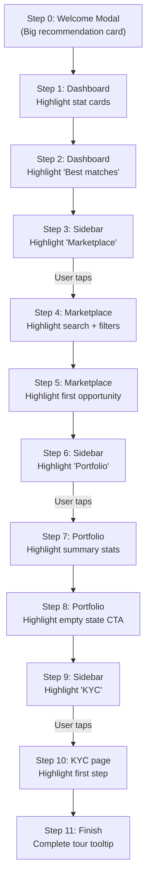

# Revamp Welcome Tour: In-Context Spotlight Tour

## What Changes

The current WelcomeTour is a **centered modal slider** with 6 generic description steps. It will be replaced with an **in-context spotlight tour** that:

1. Opens with a **large recommendation card** explaining why the top match is best, showing returns/risk/tenure, with a "Start Tour" button
2. **Highlights real elements** on each page with a spotlight cutout + tooltip
3. **Auto-scrolls** to highlighted elements
4. **Navigates between pages** by making the next sidebar/nav item glow -- the user taps it to proceed
5. **Disables all other interactions** during the tour (dimmed overlay blocks clicks on non-tour elements)
6. Stays **quick**: max 2 highlighted elements per page

---

## Tour Flow (11 steps)

### Step details

| Step | Page | Type | Target Element | Tooltip Text |
|------|------|------|----------------|-------------|
| 0 | Dashboard | modal | -- | Welcome + big recommendation card |
| 1 | Dashboard | spotlight | `[data-tour="stat-cards"]` | "Your portfolio summary -- track invested amounts, returns, and active investments at a glance." |
| 2 | Dashboard | spotlight | `[data-tour="recommendations"]` | "Opportunities matched to your risk profile. Tap any card to explore details." |
| 3 | Dashboard | nav-highlight | Sidebar "Marketplace" | "Tap Marketplace to browse all investment opportunities." |
| 4 | Marketplace | spotlight | `[data-tour="marketplace-search"]` | "Search and filter opportunities by risk, returns, tenure, and more." |
| 5 | Marketplace | spotlight | `[data-tour="marketplace-cards"]` | "Each card shows key details -- returns, risk rating, and funding progress." |
| 6 | Marketplace | nav-highlight | Sidebar "Portfolio" | "Tap Portfolio to see how your investments perform." |
| 7 | Portfolio | spotlight | `[data-tour="portfolio-summary"]` | "Your portfolio overview -- all zeros now, but will fill up as you invest." |
| 8 | Portfolio | spotlight | `[data-tour="portfolio-cta"]` | "Head to the Marketplace from here when you're ready to invest." |
| 9 | Portfolio | nav-highlight | Sidebar "KYC" | "Tap KYC to verify your identity before investing." |
| 10 | KYC | spotlight | `[data-tour="kyc-start"]` | "Complete these 4 quick steps to verify your identity and start investing." |
| 11 | KYC | finish | -- | "You're all set! Start your KYC or explore the marketplace." |

---

## Architecture

### Tour state in context ([`src/context/AppContext.jsx`](src/context/AppContext.jsx))

Add to existing context:

- `tourStep` (number, 0-11 or `null` when tour inactive)
- `setTourStep(n)` -- advance tour
- `advanceTour()` -- increment `tourStep`, call `completeTour()` at step 11

The existing `isNewUser`, `hasSeenTour`, `completeTour()` remain. `tourStep` is initialized to `0` when `isNewUser && !hasSeenTour`, otherwise `null`.

### Tour configuration (inside `WelcomeTour.jsx`)

A single `TOUR_STEPS` array defines all 11 steps with:
- `type`: `'modal'` | `'spotlight'` | `'nav'` | `'finish'`
- `target`: `data-tour` attribute value (for spotlight) or sidebar path (for nav)
- `title`, `description`, `position` (tooltip placement: top/bottom/left/right)

### Overlay + Spotlight ([`src/components/dashboard/WelcomeTour.jsx`](src/components/dashboard/WelcomeTour.jsx)) -- full rewrite

**Step type: `modal`** (step 0 only)
- Full-screen dimmed backdrop
- Large centered card with:
  - Welcome greeting with user name
  - Top recommendation as a **detailed card**: issuer name, logo, product type, return rate (large), tenure, min investment, risk rating, credit rating, a 2-3 sentence explanation of why this matches their profile, and a "Start Tour" button

**Step type: `spotlight`**
- Full-screen dimmed backdrop with a **cutout** around the target element (using `getBoundingClientRect()` + CSS clip-path or box-shadow trick)
- The target element appears "above" the overlay (via z-index or clip)
- A **tooltip card** (floating, positioned relative to the target) with title, description, step counter, and "Next" / "Skip tour" buttons
- On mount: `element.scrollIntoView({ behavior: 'smooth', block: 'center' })` before showing the tooltip

**Step type: `nav`** (steps 3, 6, 9)
- Full-screen dimmed overlay BUT the target sidebar item has a **glowing animated border** (ring + pulse) and is clickable through the overlay
- A tooltip next to the sidebar item says "Tap to continue"
- When the user clicks the highlighted sidebar NavLink, React Router navigates. The page component mounts, then the tour auto-advances to the next step (spotlight on that page)
- The Sidebar component checks `tourStep` and applies the glow class + allows pointer-events on the matching nav item

**Step type: `finish`** (step 11)
- Small centered modal: "You're all set!" with two buttons: "Complete KYC" and "Explore Marketplace"
- Calls `completeTour()`

**Interaction blocking:**
- The overlay has `pointer-events: all` to capture and block all clicks
- Spotlight target elements get `pointer-events: auto` + `position: relative` + `z-index: 60` (above overlay at z-50)
- Nav-highlighted sidebar items get the same treatment
- The "Skip tour" button is always available on every step

### Sidebar nav-step integration ([`src/components/dashboard/Sidebar.jsx`](src/components/dashboard/Sidebar.jsx))

- Read `tourStep` from context
- Map step 3 -> `/dashboard/marketplace`, step 6 -> `/dashboard/portfolio`, step 9 -> `/dashboard/kyc`
- When the current `tourStep` is a nav step, the matching NavLink gets:
  - `ring-2 ring-accent ring-offset-2 animate-pulse` (Tailwind glow)
  - `pointer-events-auto relative z-[60]` (clickable above overlay)
  - An `onClick` handler that also calls `advanceTour()` after navigation
- All other nav items are blocked during tour (overlay covers them)

### DashboardLayout ([`src/layouts/DashboardLayout.jsx`](src/layouts/DashboardLayout.jsx))

- Mount `<WelcomeTour />` here (moved from DashboardHome) so it works across page navigations
- Remove `<WelcomeTour />` from DashboardHome

### Page data-tour attributes

Each page gets `data-tour="..."` attributes on the elements to highlight:

**[`src/pages/DashboardHome.jsx`](src/pages/DashboardHome.jsx)**
- `data-tour="stat-cards"` on the stat cards grid `
`
- `data-tour="recommendations"` on the "Best matches" section `
`

**[`src/pages/Marketplace.jsx`](src/pages/Marketplace.jsx)**
- `data-tour="marketplace-search"` on the search + sort bar `
`
- `data-tour="marketplace-cards"` on the opportunities grid `
`

**[`src/pages/Portfolio.jsx`](src/pages/Portfolio.jsx)** (new user empty state)
- `data-tour="portfolio-summary"` on the zero-stat cards grid
- `data-tour="portfolio-cta"` on the empty state CTA card

**[`src/pages/KYC.jsx`](src/pages/KYC.jsx)**
- `data-tour="kyc-start"` on the main KYC form/step container (top-level wrapper)

---

## Welcome Card (Step 0) -- Detailed Recommendation

The big recommendation card replaces the current small inline card. It should include:

- Risk profile badge (Conservative / Balanced / Growth-focused)
- **Why this matches**: 2-3 sentence explanation derived from onboarding answers (e.g. "Based on your moderate risk appetite and goal to build long-term wealth, we recommend Invoice Discounting with Tata Motors Finance. This low-risk product offers 12.5% annual returns over 90 days, ideal for your short-to-medium time horizon.")
- Key metrics grid: Return Rate | Tenure | Min Investment | Risk Rating | Credit Rating
- Funding progress bar
- "Start Tour" primary button + "Skip" text link

---

## Files Changed

- [`src/components/dashboard/WelcomeTour.jsx`](src/components/dashboard/WelcomeTour.jsx) -- **Full rewrite** (spotlight tour engine + step configs + welcome card)
- [`src/context/AppContext.jsx`](src/context/AppContext.jsx) -- **Modify** (add `tourStep`, `setTourStep`, `advanceTour`)
- [`src/components/dashboard/Sidebar.jsx`](src/components/dashboard/Sidebar.jsx) -- **Modify** (highlight nav items during tour, allow clicks)
- [`src/layouts/DashboardLayout.jsx`](src/layouts/DashboardLayout.jsx) -- **Modify** (mount WelcomeTour here)
- [`src/pages/DashboardHome.jsx`](src/pages/DashboardHome.jsx) -- **Modify** (add data-tour attrs, remove WelcomeTour mount)
- [`src/pages/Marketplace.jsx`](src/pages/Marketplace.jsx) -- **Modify** (add data-tour attrs)
- [`src/pages/Portfolio.jsx`](src/pages/Portfolio.jsx) -- **Modify** (add data-tour attrs)
- [`src/pages/KYC.jsx`](src/pages/KYC.jsx) -- **Modify** (add data-tour attr on wrapper)
- [`src/components/dashboard/MobileTabBar.jsx`](src/components/dashboard/MobileTabBar.jsx) -- **Modify** (highlight nav items during tour for mobile)
