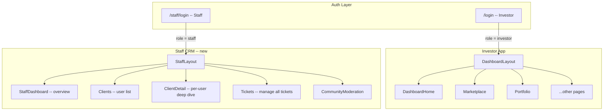

# Staff CRM Dashboard

## Current State

The app is a single Vite + React SPA at `/` (landing), `/login` (investor auth), and `/dashboard/*` (investor portal). Auth uses Supabase, with a `profiles` table but **no role system**. Existing tables: `profiles`, `investments`, `watchlist`, `tickets`, `community_posts`, `community_comments`, `community_likes`. RLS is disabled.

---

## Architecture



### URL structure

- `/staff/login` -- dedicated staff sign-in/sign-up page (same Supabase auth, profile gets `role = 'staff'`)
- `/staff` -- CRM overview (stats, recent tickets, recent sign-ups)
- `/staff/clients` -- searchable, filterable client table with priority tags
- `/staff/clients/:id` -- single client deep-dive (profile, investments, KYC, tickets, RM notes)
- `/staff/tickets` -- all tickets across all users, status management, resolution notes
- `/staff/community` -- community moderation (view/hide/delete posts, review flagged content)

### Design principles

- **No playful elements.** No welcome tours, no robo-chat, no gamification.
- Dense, data-forward layout: tables with sort/filter, not card grids.
- Monochromatic palette reusing the existing theme tokens (`text-primary`, `border`, `bg-alt`, `accent`). Status colors only for badges (green/amber/red/blue).
- Compact sidebar (icon + label), breadcrumb header, no mobile tab bar (desktop-first professional tool).
- Every data view has loading skeleton, empty state, and error state.
- All reads/writes go through Supabase -- no mock data in the CRM.

---

## 1. Database Migration

Create **`supabase/staff_crm.sql`** with the following changes:

### Modify `profiles`

```sql
-- Add role column (existing users default to 'investor')
ALTER TABLE profiles ADD COLUMN IF NOT EXISTS role TEXT DEFAULT 'investor'
  CHECK (role IN ('investor', 'staff'));

-- Priority set by RM (null = unset)
ALTER TABLE profiles ADD COLUMN IF NOT EXISTS priority TEXT DEFAULT NULL
  CHECK (priority IN ('high', 'medium', 'low', NULL));

-- Index for staff queries
CREATE INDEX IF NOT EXISTS idx_profiles_role ON profiles(role);
```

### New table: `staff_notes`

```sql
CREATE TABLE IF NOT EXISTS staff_notes (
  id UUID PRIMARY KEY DEFAULT gen_random_uuid(),
  client_id UUID NOT NULL REFERENCES profiles(id) ON DELETE CASCADE,
  author_id UUID NOT NULL REFERENCES profiles(id) ON DELETE CASCADE,
  content TEXT NOT NULL,
  created_at TIMESTAMPTZ DEFAULT NOW()
);
ALTER TABLE staff_notes DISABLE ROW LEVEL SECURITY;
CREATE INDEX IF NOT EXISTS idx_staff_notes_client ON staff_notes(client_id);
```

### Modify `tickets`

```sql
ALTER TABLE tickets ADD COLUMN IF NOT EXISTS assigned_to UUID REFERENCES profiles(id);
ALTER TABLE tickets ADD COLUMN IF NOT EXISTS resolution_notes TEXT;
```

### Modify `community_posts`

```sql
ALTER TABLE community_posts ADD COLUMN IF NOT EXISTS hidden BOOLEAN DEFAULT FALSE;
ALTER TABLE community_posts ADD COLUMN IF NOT EXISTS hidden_by UUID REFERENCES profiles(id);
ALTER TABLE community_posts ADD COLUMN IF NOT EXISTS hidden_at TIMESTAMPTZ;
```

---

## 2. New Files to Create

### Context

- **`src/context/StaffContext.jsx`** -- separate context for the CRM. Handles:
  - Staff auth check (load profile, verify `role === 'staff'`)
  - `fetchAllClients()` -- `profiles` where `role = 'investor'`, joined with aggregate counts
  - `fetchClientDetail(id)` -- profile + investments + tickets + notes
  - `updateClientPriority(id, priority)`
  - `addStaffNote(clientId, content)`
  - `fetchAllTickets(filters)` -- all tickets with profile join
  - `updateTicketStatus(id, status, resolutionNotes)`
  - `assignTicket(id, staffId)`
  - `fetchCommunityPosts()` -- all posts including hidden
  - `hidePost(id)` / `unhidePost(id)` / `deletePost(id)`
  - `deleteComment(id)`
  - Dashboard aggregate stats (total users, AUM, open tickets, new signups this week)

### Layout

- **`src/layouts/StaffLayout.jsx`** -- professional shell: fixed sidebar, header with breadcrumbs, `<Outlet />`

### Components (`src/components/staff/`)

- **`StaffSidebar.jsx`** -- compact nav: Overview, Clients, Tickets, Community, Logout
- **`StaffHeader.jsx`** -- breadcrumb trail, staff name/avatar, no notifications bell
- **`DataTable.jsx`** -- reusable sortable/filterable table component (used across clients, tickets)
- **`StatusBadge.jsx`** -- tiny pill for ticket status, KYC status, priority
- **`StatCard.jsx`** -- CRM-style stat card (number + label + trend, no icons)

### Pages (`src/pages/staff/`)

- **`StaffLogin.jsx`** -- minimal login form. Same Supabase `signInWithPassword` / `signUp`. On sign-up, inserts profile with `role: 'staff'`. Redirects to `/staff`. If already authenticated as staff, redirects immediately.
- **`StaffDashboard.jsx`** -- overview grid:
  - Row 1: Stat cards (Total Clients, Total AUM, Open Tickets, New Signups this week)
  - Row 2: Recent tickets table (last 10), Recent signups table (last 10)
- **`Clients.jsx`** -- full client list:
  - Search by name/email
  - Filter by KYC status, priority, onboarding status
  - Sort by joined date, total invested, name
  - Columns: Name, Email, KYC Status, Priority, Total Invested, Active Investments, Joined Date
  - Row click navigates to `/staff/clients/:id`
- **`ClientDetail.jsx`** -- tabbed single-client view:
  - **Overview tab**: profile info, KYC status, investor quadrant, portfolio summary
  - **Investments tab**: table of all investments with status
  - **Tickets tab**: client's tickets with inline status update
  - **Notes tab**: chronological RM notes with "add note" form
  - Priority selector (dropdown) in the header area
- **`Tickets.jsx`** -- all-tickets view:
  - Filter by status (open / in_progress / resolved / closed), category
  - Search by ticket number, subject, client name
  - Expandable rows showing description + resolution notes
  - Inline status update dropdown + resolution notes textarea
- **`CommunityModeration.jsx`** -- post list:
  - All posts (including hidden) in reverse chronological order
  - Each post shows author, content, likes/comments count, hidden status
  - Actions: Hide/Unhide, Delete post, expand to see comments, delete individual comments

---

## 3. Routing Changes

In [src/App.jsx](src/App.jsx), add:

```jsx
import StaffLogin from './pages/staff/StaffLogin';
import StaffLayout from './layouts/StaffLayout';
import StaffDashboard from './pages/staff/StaffDashboard';
import Clients from './pages/staff/Clients';
import ClientDetail from './pages/staff/ClientDetail';
import StaffTickets from './pages/staff/Tickets';
import CommunityModeration from './pages/staff/CommunityModeration';

// New protected route for staff
function StaffRoute({ children }) {
  // checks isAuthenticated AND role === 'staff'
  // redirects to /staff/login if not
}
```

New routes added alongside existing ones:

```jsx
<Route path="/staff/login" element={<StaffLogin />} />
<Route path="/staff" element={<StaffRoute><StaffLayout /></StaffRoute>}>
  <Route index element={<StaffDashboard />} />
  <Route path="clients" element={<Clients />} />
  <Route path="clients/:id" element={<ClientDetail />} />
  <Route path="tickets" element={<StaffTickets />} />
  <Route path="community" element={<CommunityModeration />} />
</Route>
```

---

## 4. Existing Code Changes

- **`src/pages/Community.jsx`** -- filter out posts where `hidden = true` so investors don't see moderated content (add `.eq('hidden', false)` to the community fetch in AppContext).
- **`src/context/AppContext.jsx`** -- add `role` to the user state loaded from `profiles`; export it in the context value. Add `hidden` filter to `fetchCommunityPosts`.
- **`src/pages/Login.jsx`** -- add a small "Staff login" text link at the bottom pointing to `/staff/login`.

---

## 5. File Tree (new files only)

```
src/
  context/
    StaffContext.jsx
  layouts/
    StaffLayout.jsx
  components/
    staff/
      StaffSidebar.jsx
      StaffHeader.jsx
      DataTable.jsx
      StatusBadge.jsx
      StatCard.jsx
  pages/
    staff/
      StaffLogin.jsx
      StaffDashboard.jsx
      Clients.jsx
      ClientDetail.jsx
      Tickets.jsx
      CommunityModeration.jsx
supabase/
  staff_crm.sql
```

Total: **1 SQL file**, **1 context**, **1 layout**, **5 components**, **5 pages**, plus minor edits to 3 existing files.
