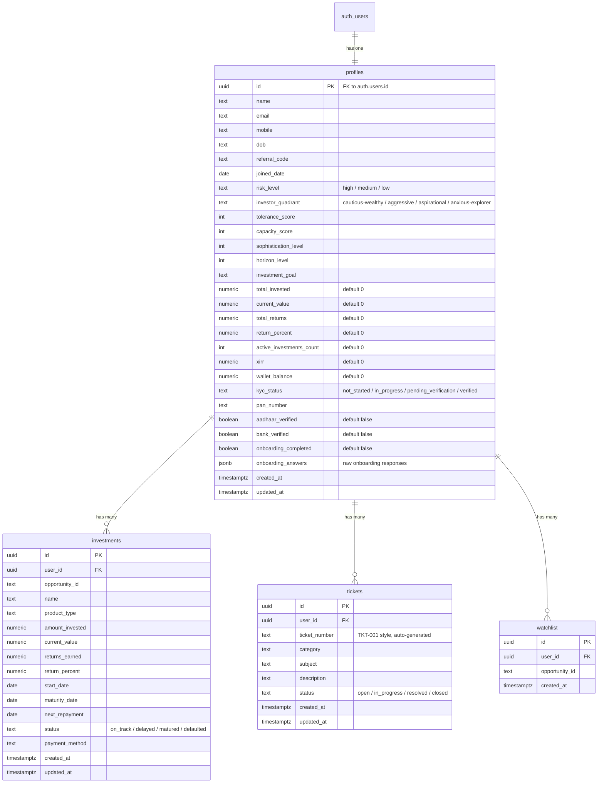

# Supabase Integration for YieldVest

## Database Schema Design

Four tables linked to Supabase Auth's `auth.users` via `user_id`. RLS is **disabled** on all tables per requirement.



### Key design decisions

- **`profiles`** is the single source of truth for user data -- it stores both identity info (name, email, mobile, dob) and computed portfolio aggregates (total_invested, current_value, etc.) plus investor profile data derived from onboarding (risk_level, quadrant, scores)
- **`risk_level`** is derived from `investor_quadrant`: aggressive = high, cautious-wealthy = medium, anxious-explorer/aspirational = low -- stored explicitly for easy querying
- **`investments`** stores every individual investment record; portfolio aggregates in `profiles` are updated when investments are created
- **`tickets`** stores support tickets with auto-incrementing `ticket_number` (via a DB function)
- **`watchlist`** is a simple junction table for opportunity bookmarks
- **`onboarding_answers`** stored as JSONB so the raw onboarding data is preserved for future re-computation

---

## Files to Create

### 1. `.env` -- Supabase credentials

```
VITE_SUPABASE_URL=https://oomkjuzjyccfhtguuytp.supabase.co
VITE_SUPABASE_PUBLISHABLE_KEY=sb_publishable_SQSBapi7Qhfhd1sl0_AANA_37dIr4SN
SUPABASE_SECRET_KEY=sb_secret_hdA8LX1JN0aNrrHiaCiqAQ_cxLwWUSP
```

### 2. `src/lib/supabase.js` -- Supabase client initialization

Create the Supabase client using `@supabase/supabase-js` with `VITE_SUPABASE_URL` and `VITE_SUPABASE_PUBLISHABLE_KEY` from `import.meta.env`.

### 3. `supabase/schema.sql` -- Full SQL migration

All `CREATE TABLE` statements, ticket number generation function + trigger, indexes on `user_id` columns, and `ALTER TABLE ... DISABLE ROW LEVEL SECURITY` for every table.

---

## Files to Modify

### 4. [package.json](package.json) -- Add `@supabase/supabase-js` dependency

### 5. [.gitignore](.gitignore) -- Add `.env` to prevent committing secrets

### 6. [src/context/AppContext.jsx](src/context/AppContext.jsx) -- Major refactor

This is the biggest change. Replace localStorage persistence with Supabase:

- **Auth**: Replace mock `login()` / `registerNewUser()` / `loginWithDigiLocker()` / `logout()` with Supabase Auth (`supabase.auth.signUp`, `signInWithPassword`, `signOut`)
- **Session**: Use `supabase.auth.onAuthStateChange` to detect login/logout and load profile + investments from DB
- **Profile loading**: On auth, fetch from `profiles` table; if new user, insert a row
- **`createInvestment`**: Insert into `investments` table and update `profiles` aggregates
- **Watchlist**: CRUD against `watchlist` table
- **State init**: Fetch `investments`, `watchlist`, `tickets` from Supabase on login instead of from `mockData.js`

### 7. [src/pages/Login.jsx](src/pages/Login.jsx)

- Replace mock credential check with `supabase.auth.signInWithPassword({ email, password })`
- Replace DigiLocker mock with appropriate Supabase signup flow
- Handle Supabase auth errors (invalid credentials, email not confirmed, etc.)

### 8. [src/pages/Onboarding.jsx](src/pages/Onboarding.jsx)

- After onboarding answers are collected, update the `profiles` row with investor profile data (quadrant, risk_level, scores, onboarding_completed = true)

### 9. [src/pages/Support.jsx](src/pages/Support.jsx)

- Replace `mockTickets` with a Supabase query (`select * from tickets where user_id = ...`)
- Wire "Raise a Ticket" form submit to insert into `tickets` table

### 10. [src/pages/Profile.jsx](src/pages/Profile.jsx)

- Wire profile edit (name, email, mobile, dob) to update `profiles` table

### 11. [src/pages/KYC.jsx](src/pages/KYC.jsx)

- Update KYC status changes to persist to `profiles.kyc_status`, `pan_number`, `aadhaar_verified`, `bank_verified`

---

## Implementation Order

The work follows a dependency chain: schema first, then client, then auth, then data operations.
